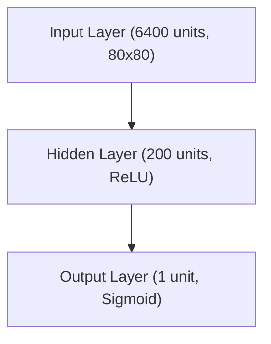
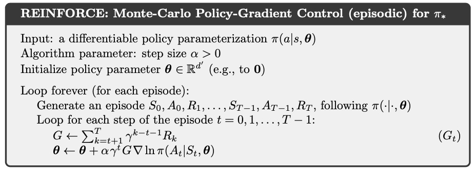

# RL: Policy Gradient Methods

## Network Architecture

The policy network (MLP) used in this project has the following architecture:

```mermaid
graph TD
    A["Input Layer (6400 units, 80x80)"] --> B["Hidden Layer (200 units, ReLU)"]
    B --> C["Output Layer (1 unit, Sigmoid)"]
```

