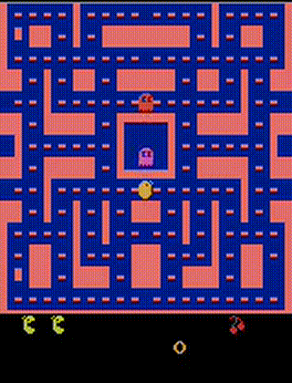
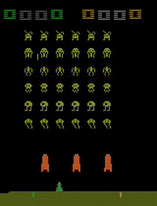

# Game AI & Reinforcement Learning

[](https://github.com/shehio/rl/actions/workflows/build.yml)
[](https://github.com/shehio/rl/actions/workflows/test.yml)


A comprehensive repository for implementing and experimenting with various reinforcement learning algorithms and classical game AI techniques. The objective of this repo is not to create the best playing agent but to experiment and explore different agents playing board games and video games.

## Project Overview

This repository contains implementations of:
- **Reinforcement Learning Algorithms**: Policy Gradient (REINFORCE), Deep Q-Network (DQN), PPO, A2C
- **Classical Game AI**: Chess engines, graph search algorithms
- **Game Environments**: Atari games, chess, puzzle games
- **Infrastructure**: Cloud deployment, model management

## Directory

```
rl/
├── atari/                # Atari game implementations
│   ├── algorithms/       # Custom RL implementations
│   │   ├── dqn/          # Deep Q-Network
│   │   └── pg/           # Policy Gradient
│   ├── baselines/        # Stable Baselines3 implementations
│   ├── models/           # All trained models
│   └── common/           # Shared utilities
├── chess/                # Chess engine integration
├── graph-search/         # Classical search algorithms
├── terraform/            # Cloud infrastructure
└── assets/               # Images and resources
```

## Quick Start

### Prerequisites
```bash
./init.sh
```

### Virtual Environment Setup
The project uses a Python virtual environment to manage dependencies. The `init.sh` script automatically:
- Creates a virtual environment (`venv/`)
- Installs all required packages from `requirements.txt`
- Downloads Atari ROMs via AutoROM
- Installs and configures pre-commit hooks for code formatting

**Important Notes:**
- Always activate the virtual environment before running scripts: `source venv/bin/activate`
- The virtual environment must be activated from the root `rl/` directory
- You can navigate to subdirectories after activation - the environment persists in the same shell session
- If you see `(venv)` in your prompt, the virtual environment is active

### Code Quality & Pre-commit Hooks
The project includes pre-commit hooks that automatically:
- Format code with Black (line length: 88 characters)
- Remove trailing whitespace
- Fix end-of-file issues
- Check for merge conflicts
- Validate YAML files

To manually run the hooks: `pre-commit run --all-files`

### Atari Games (Reinforcement Learning)
```bash
# For detailed instructions, see atari/README.md
cd atari/baselines
python atari_baseline_train.py --algorithm ppo --env ALE/Pong-v5
```

**Recording Gameplay:**
```bash
# Record gameplay using the most recent model
python record_gameplay.py <game_name>
# Example: python record_gameplay.py spaceinvaders
```

The recording script automatically:
- Finds the most recent trained model for the specified game
- Records gameplay and saves as MP4 video
- Converts to GIF format for easy viewing
- Uses precise timestep naming (e.g., "7.5M" for 7,500,000 steps)
- Saves files to `assets/videos/` directory

### Chess Engines
```bash
# For detailed instructions, see chess/README.md
cd chess
./build_chess_engines.sh
python stockfish_vs_leela.py
```

### Graph Search
```bash
# For detailed instructions, see graph-search/README.md
cd graph-search
python river-crossing-puzzle.py
```

## Detailed Documentation

### Theory & Algorithms
- **[THEORY.md](THEORY.md)** - Comprehensive guide to RL algorithms and theory

### Atari Games & RL
- **[atari/README.md](atari/README.md)** - Complete guide to Atari implementations
- **[atari/algorithms/dqn/README.md](atari/algorithms/dqn/README.md)** - DQN implementation details
- **[atari/algorithms/pg/README.md](atari/algorithms/pg/README.md)** - Policy Gradient implementation details
- **[atari/baselines/README.md](atari/baselines/README.md)** - Stable Baselines3 usage guide

### Chess & Classical AI
- **[chess/README.md](chess/README.md)** - Chess engine integration guide

### Infrastructure
- **[terraform/README.md](terraform/README.md)** - Cloud deployment setup

## 🎮 Supported Games & Algorithms

### Atari Games
- **Pong**: Binary actions (UP/DOWN)
- **Breakout**: Binary actions (LEFT/RIGHT)
- **Ms. Pacman**: 9 discrete actions
- **Any Atari game**: Via Stable Baselines3

### Algorithms
- **Policy Gradient (REINFORCE)**: Custom PyTorch implementation
- **Deep Q-Network (DQN)**: Custom implementation with Dueling CNN
- **Stable Baselines3**: PPO, DQN, A2C with automatic checkpointing

### Chess
- **Stockfish**: World's strongest chess engine
- **Leela Chess Zero**: Neural network-based engine
- **Game Analysis**: Move analysis and evaluation

## Key Features

- **Algorithm-Centric Organization**: Each algorithm has its own space
- **Model Management**: Organized model storage by algorithm and game
- **Cloud Ready**: Terraform configurations for AWS deployment
- **Comprehensive Testing**: Test scripts for all implementations
- **Documentation**: Detailed guides for each component

## Performance

### Demo: Pong DQN Agent

Watch our trained Deep Q-Network (DQN) agent playing Pong after 6 million training steps:


**Model Details:**
- **Algorithm**: Deep Q-Network (DQN) with Dueling CNN architecture
- **Environment**: ALE/Pong-v5 (Atari Learning Environment)
- **Training Steps**: 6,000,000
- **Architecture**: Convolutional Neural Network with dueling streams
- **Performance**: Achieves consistent high scores through strategic paddle positioning

**Technical Specifications:**
- **Input**: 4 stacked grayscale frames (84x84 pixels)
- **Actions**: 2 discrete actions (UP/DOWN)
- **Network**: 3 convolutional layers + dueling streams (value + advantage)
- **Training**: Experience replay, target networks, epsilon-greedy exploration

The agent demonstrates strong gameplay by learning to predict ball trajectories and position the paddle optimally. The dueling architecture separates value and advantage estimation for more stable learning.

### Demo: Breakout DQN Agent

Watch our trained Deep Q-Network (DQN) agent playing Breakout after 5 million training steps:


**Model Details:**
- **Algorithm**: Deep Q-Network (DQN) with Dueling CNN architecture
- **Environment**: ALE/Breakout-v5 (Atari Learning Environment)
- **Training Steps**: 5,000,000
- **Architecture**: Convolutional Neural Network with dueling streams
- **Performance**: Demonstrates advanced brick-breaking strategy and paddle control

**Technical Specifications:**
- **Input**: 4 stacked grayscale frames (84x84 pixels)
- **Actions**: 3 discrete actions (LEFT/RIGHT/FIRE)
- **Network**: 3 convolutional layers + dueling streams (value + advantage)
- **Training**: Experience replay, target networks, epsilon-greedy exploration

The agent shows improved strategic gameplay by learning to break bricks efficiently while maintaining paddle control. The enhanced life tracking ensures episodes run until all lives are lost, providing longer gameplay demonstrations.

### Demo: Ms. Pacman DQN Agent

Watch our trained Deep Q-Network (DQN) agent playing Ms. Pacman after 10 million training steps:



**Model Details:**
- **Algorithm**: Deep Q-Network (DQN) with Dueling CNN architecture
- **Environment**: ALE/MsPacman-v5 (Atari Learning Environment)
- **Training Steps**: 10,000,000
- **Architecture**: Convolutional Neural Network with dueling streams
- **Performance**: Advanced maze navigation, ghost avoidance, and power pellet strategy

**Technical Specifications:**
- **Input**: 4 stacked grayscale frames (84x84 pixels)
- **Actions**: 9 discrete actions (8 directions + no-op)
- **Network**: 3 convolutional layers + dueling streams (value + advantage)
- **Training**: Experience replay, target networks, epsilon-greedy exploration

The agent demonstrates sophisticated gameplay by learning to navigate complex mazes, collect dots efficiently, avoid ghosts strategically, and utilize power pellets effectively. The extended training (10M steps) enables the agent to develop advanced strategies for this complex multi-action environment.

### Demo: Space Invaders DQN Agent

Watch our trained Deep Q-Network (DQN) agent playing Space Invaders after 7.5 million training steps:



**Model Details:**
- **Algorithm**: Deep Q-Network (DQN) with Dueling CNN architecture
- **Environment**: ALE/SpaceInvaders-v5 (Atari Learning Environment)
- **Training Steps**: 7,500,000
- **Architecture**: Convolutional Neural Network with dueling streams
- **Performance**: Strategic alien targeting, shield utilization, and movement optimization

**Technical Specifications:**
- **Input**: 4 stacked grayscale frames (84x84 pixels)
- **Actions**: 3 discrete actions (LEFT/RIGHT/FIRE)
- **Network**: 3 convolutional layers + dueling streams (value + advantage)
- **Training**: Experience replay, target networks, epsilon-greedy exploration

The agent demonstrates effective gameplay by learning to prioritize targets, use shields strategically, and maintain optimal positioning. The precise timestep naming (7.5M) reflects the exact training duration, showcasing the agent's development through extended training.

## Contributing

1. Choose the appropriate subdirectory for your contribution
2. Follow the existing code structure and documentation
3. Update relevant README files
4. Test your changes thoroughly

## License

This project is licensed under the MIT License - see the [LICENSE](LICENSE) file for details.

## Resources

- [Gymnasium](https://gymnasium.farama.org/) - RL environments
- [Stable Baselines3](https://stable-baselines3.readthedocs.io/) - RL algorithms
- [Deep Reinforcement Learning: Pong from Pixels](https://karpathy.github.io/2016/05/31/rl/) - Andrej Karpathy's excellent tutorial on Policy Gradients
- [Frame Skipping and Preprocessing for Deep Q-Networks on Atari 2600 Games](https://danieltakeshi.github.io/2016/11/25/frame-skipping-and-preprocessing-for-deep-q-networks-on-atari-2600-games/) - Technical guide on Atari preprocessing techniques
- [Stockfish](https://stockfishchess.org/) - Chess engine
- [Leela Chess Zero](https://lczero.org/) - Neural chess engine
