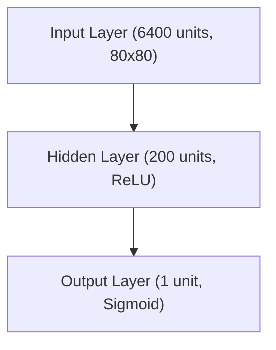

# RL: Policy Gradient Methods

## Network Architecture

The policy network (MLP) used in this project has the following architecture:

### Resources
- [Policy Gradients Revisited: Pong from Pixels](https://youtu.be/tqrcjHuNdmQ?si=XElMeYhPr7vCBb1b)
- [REINFORCE: Reinforcement Learning Most Fundamental Algorithm](https://youtu.be/5eSh5F8gjWU?si=b1lRf6Ks_q_0dekA)