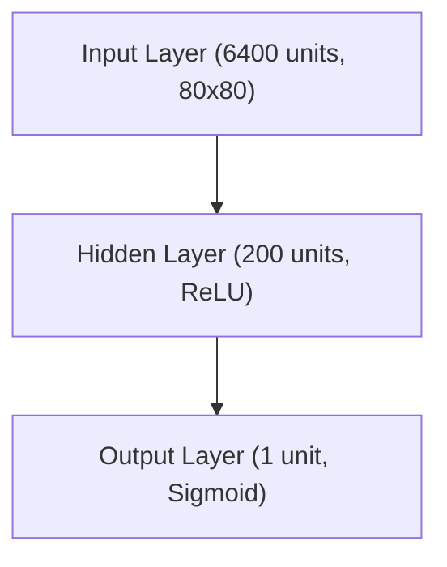

# RL: Policy Gradient Methods

## Project Overview
This project implements a minimal, educational version of policy gradient reinforcement learning (REINFORCE) to train an agent to play Atari Pong. The code is modular, easy to follow, and inspired by classic deep RL tutorials.

## Features
- Simple MLP policy network (NumPy or PyTorch)
- Modular code: agent, memory, hyperparameters, game environment
- Frame preprocessing and reward normalization
- Easy to switch between native and PyTorch MLP
- Type-annotated for clarity and robustness

## Directory Structure
```
pong/
├── agent.py           # Agent logic and policy gradient updates
├── game.py            # Game environment and episode management
├── hyperparameters.py # Hyperparameter container
├── memory.py          # Memory buffer for episode data
├── mlp.py             # Minimal MLP (NumPy)
├── mlp_torch.py       # MLP (PyTorch)
├── assets/            # Images and diagrams
│   └── reinforce.png  # REINFORCE algorithm diagram
├── README.md          # This file
└── ppgong.py          # Main training script
```

## Setup
1. **Install Python 3.10 or 3.11** (recommended)
2. **Create and activate a virtual environment:**
   ```sh
   python3.10 -m venv venv
   source venv/bin/activate
   ```
3. **Install dependencies:**
   ```sh
   pip install -r requirements.txt
   ```

## Usage
To train the agent on Pong:
```sh
python ppgong.py
```
- By default, the script will train the agent and periodically save the model.
- To watch the agent play, set `render = True` in `ppgong.py`.

## Network Architecture
The policy network (MLP) used in this project has the following architecture:



## REINFORCE Algorithm


## Resources
- [Policy Gradients Revisited: Pong from Pixels](https://youtu.be/tqrcjHuNdmQ?si=XElMeYhPr7vCBb1b)
- [REINFORCE: Reinforcement Learning Most Fundamental Algorithm](https://youtu.be/5eSh5F8gjWU?si=b1lRf6Ks_q_0dekA)
- [Karpathy's blog post: "Pong from Pixels"](http://karpathy.github.io/2016/05/31/rl/)
- [OpenAI Gym documentation](https://www.gymlibrary.dev/)