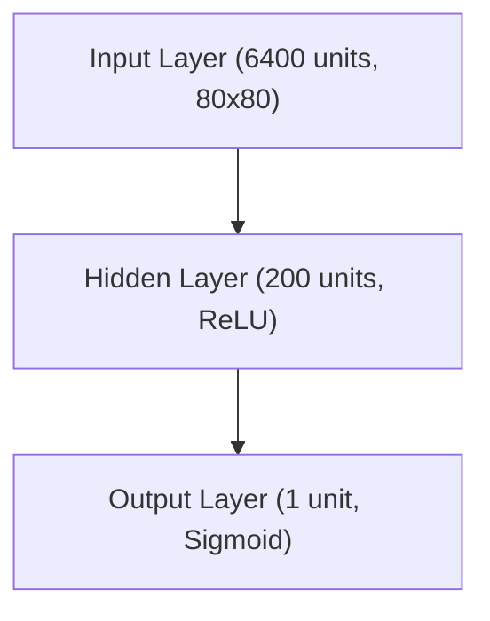

# RL: Policy Gradient Methods & Deep Q-Learning

## Project Overview
This project implements both Policy Gradient (REINFORCE) and Deep Q-Network (DQN) reinforcement learning algorithms to train agents to play Atari games including Pong and Breakout. The code is modular, easy to follow, and inspired by classic deep RL tutorials. The project has been significantly uses modern Python, PyTorch, and cloud infrastructure.

## Features
- **Dual Algorithm Support**: Both Policy Gradient (REINFORCE) and Deep Q-Network (DQN) implementations
- **Multi-Game Support**: Train on Pong, Breakout, and other Atari games with proper game-specific handling
- **Modern Gymnasium**: Upgraded from deprecated `gym` to modern `gymnasium` library
- **Python 3.13 Support**: Updated to work with the latest Python versions
- **PyTorch Optimization**: Enhanced MLP implementation with batch processing and GPU support
- **AWS GPU Hosting**: Complete cloud infrastructure with Terraform for GPU training
- **Advanced Model Management**: Sophisticated save/load system with episode tracking and versioning
- **Performance Tracking**: Real-time training metrics and episode statistics
- **Performance Optimizations**: GPU acceleration and batch processing improvements
- **Game-Specific Logic**: Proper handling of different game mechanics (e.g., FIRE action for Breakout)
- **Modular Architecture**: Clean separation of agent, memory, hyperparameters, and game environment
- **Frame Preprocessing**: Optimized image processing for neural network input
- **Type Annotations**: Full type safety for robust development

## Policy Gradients vs DQN: A Comparison

| Aspect | Policy Gradients (REINFORCE) | Deep Q-Network (DQN) |
|--------|------------------------------|----------------------|
| **Approach** | Policy-based (learns π(s) → a) | Value-based (learns Q(s,a)) |
| **Learning Type** | On-policy | Off-policy |
| **Action Spaces** | Continuous & Discrete | Discrete only |
| **Policy Type** | Stochastic | Deterministic |
| **Sample Efficiency** | Lower (requires more samples) | Higher (experience replay) |
| **Training Stability** | Less stable (high variance) | More stable (target networks) |
| **Implementation** | Simpler | More complex |
| **Best For** | Continuous actions, stochastic policies | Discrete actions, large state spaces |
| **Key Features** | Direct policy optimization | Experience replay, target networks |

## Directory Structure
```
Policy-Gradient/
├── src/                   # Source code modules
│   ├── pg/                # Policy Gradient implementation
│   │   ├── agent.py       # PG agent logic
│   │   ├── game.py        # Game environment
│   │   ├── hyperparameters.py # PG hyperparameters
│   │   ├── memory.py      # Episode memory buffer
│   │   ├── mlp.py         # Legacy MLP (NumPy)
│   │   └── mlp_torch.py   # Modern MLP (PyTorch)
│   └── dqn/               # DQN implementation
│       ├── agent.py       # DQN agent logic
│       ├── model.py       # Dueling CNN model
│       └── config/        # DQN configuration classes
│           ├── environment_config.py
│           ├── model_config.py
│           ├── training_config.py
│           ├── learning_config.py
│           ├── exploration_config.py
│           ├── image_config.py
│           └── hyperparameters.py
├── scripts/               # Executable scripts
│   ├── policy-gradient/   # PG training scripts
│   │   ├── pgpong.py      # Pong PG training
│   │   └── pgbreakout.py  # Breakout PG training
│   ├── dqn/               # DQN training scripts
│   │   ├── pong-dqn.py    # DQN Pong training
│   │   └── models/        # DQN model files
│   │       └── pong-cnn-* # DQN Pong models
│   ├── game_model_manager.py # Model management utilities
│   └── run_in_cloud.sh    # Cloud deployment script
├── models/                # Trained model files
│   ├── torch_mlp_ALE_Pong_v5_* # PG Pong models
│   ├── torch_mlp_ALE_Breakout_v5_* # PG Breakout models
├── terraform/             # Infrastructure as Code
│   ├── main.tf            # Main Terraform configuration
│   ├── variables.tf       # Variable definitions
│   ├── outputs.tf         # Output definitions
│   ├── setup.sh           # Instance setup script
│   └── check_status.sh    # Status monitoring script
├── assets/                # Images and diagrams
│   └── reinforce.png      # REINFORCE algorithm diagram
├── requirements.txt       # Python dependencies
└── README.md              # This file
```

## Setup
1. **Install Python 3.11+** (recommended: 3.13)
2. **Create and activate a virtual environment:**
   ```sh
   python3.13 -m venv venv
   source venv/bin/activate
   ```
3. **Install dependencies:**
   ```sh
   pip install -r requirements.txt
   ```

## Usage

### Policy Gradient Training
**Train on Pong:**
```sh
python scripts/policy-gradient/pgpong.py
```

**Train on Breakout:**
```sh
python scripts/policy-gradient/pgbreakout.py
```

### DQN Training
**Train on Pong:**
```sh
python scripts/dqn/pong-dqn.py
```

### Model Management
The system automatically saves models every 1000 episodes with episode numbers:
- `torch_mlp_i1000` - Model after 1000 episodes
- `torch_mlp_i2000` - Model after 2000 episodes
- etc.

**Load a specific model:**
```python
load_episode_number = 20000  # Load model from episode 20000
```

### Cloud GPU Training
1. **Deploy to AWS:**
   ```sh
   cd terraform
   terraform init
   terraform apply
   terraform destroy
   ```

2. **Monitor training:**
   ```sh
   ./check_status.sh
   ```

3. **Download results:**
   ```sh
   scp -i your-key.pem ubuntu@your-instance:~/Policy-Gradient/models/ ./models/
   ```

## Policy Gradient Implementation

### REINFORCE Algorithm


### Network Architecture
The PyTorch policy network features:
- **Input Layer**: 6400 units (80x80 preprocessed frames)
- **Hidden Layer**: 200 units with ReLU activation
- **Output Layer**: 1 unit with Sigmoid activation
- **GPU Acceleration**: Automatic CUDA support when available
- **Batch Processing**: Optimized for efficient training




## DQN Implementation

### Network Architecture
The DQN uses a Dueling CNN architecture:
- **Input Layer**: Preprocessed game frames (80x64 grayscale)
- **Convolutional Layers**: Feature extraction from game pixels
- **Dueling Architecture**: Separate value and advantage streams
- **Output Layer**: Q-values for each action
- **Experience Replay**: Stores and samples past experiences
- **Target Network**: Stabilizes training with separate target network

### Key Features
- **Experience Replay Buffer**: Stores (state, action, reward, next_state, done) tuples
- **Target Network**: Separate network for computing target Q-values
- **Epsilon-Greedy Exploration**: Balances exploration vs exploitation
- **Frame Stacking**: Uses 4 consecutive frames as state representation

## Resources
- [Policy Gradients Revisited: Pong from Pixels](https://youtu.be/tqrcjHuNdmQ?si=XElMeYhPr7vCBb1b)
- [REINFORCE: Reinforcement Learning Most Fundamental Algorithm](https://youtu.be/5eSh5F8gjWU?si=b1lRf6Ks_q_0dekA)
- [Karpathy's blog post: "Pong from Pixels"](http://karpathy.github.io/2016/05/31/rl/)
- [Gymnasium Documentation](https://gymnasium.farama.org/)
- [PyTorch Documentation](https://pytorch.org/docs/)
- [Terraform AWS Provider](https://registry.terraform.io/providers/hashicorp/aws/latest/docs)

## Contributing
This project is designed for educational purposes. Feel free to:
- Add support for more Atari games
- Implement additional RL algorithms
- Improve the cloud infrastructure
- Add more sophisticated monitoring tools

## License
This project is open source and available under the MIT License.