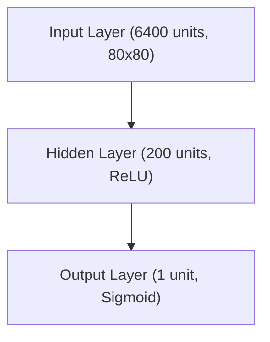

# RL: Policy Gradient Methods

## Project Overview
This project implements a minimal, educational version of policy gradient reinforcement learning (REINFORCE) to train an agent to play Atari games including Pong and Breakout. The code is modular, easy to follow, and inspired by classic deep RL tutorials. The project has been significantly upgraded with modern Python, PyTorch, and cloud infrastructure.

## Features
- **Multi-Game Support**: Train on Pong, Breakout, and other Atari games with proper game-specific handling
- **Modern Gymnasium**: Upgraded from deprecated `gym` to modern `gymnasium` library
- **Python 3.13 Support**: Updated to work with the latest Python versions
- **PyTorch Optimization**: Enhanced MLP implementation with batch processing and GPU support
- **AWS GPU Hosting**: Complete cloud infrastructure with Terraform for GPU training
- **Advanced Model Management**: Sophisticated save/load system with episode tracking and versioning
- **Performance Tracking**: Real-time training metrics and episode statistics
- **Performance Optimizations**: GPU acceleration and batch processing improvements
- **Game-Specific Logic**: Proper handling of different game mechanics (e.g., FIRE action for Breakout)
- **Modular Architecture**: Clean separation of agent, memory, hyperparameters, and game environment
- **Frame Preprocessing**: Optimized image processing for neural network input
- **Type Annotations**: Full type safety for robust development

## Directory Structure
```
Policy-Gradient/
├── src/                   # Source code modules
│   ├── agent.py           # Agent logic and policy gradient updates
│   ├── game.py            # Game environment with gymnasium support
│   ├── hyperparameters.py # Hyperparameter container
│   ├── memory.py          # Memory buffer for episode data
│   ├── mlp.py             # Legacy MLP (NumPy)
│   └── mlp_torch.py       # Modern MLP (PyTorch) with GPU support
├── scripts/               # Executable scripts
│   ├── pgpong.py          # Pong training script
│   ├── pgbreakout.py      # Breakout training script
│   ├── game_model_manager.py # Model management utilities
│   └── run_in_cloud.sh    # Cloud deployment script
├── models/                # Trained model files
│   ├── torch_mlp_ALE_Pong_v5_* # Pong model checkpoints|
│   ├── torch_mlp_ALE_Breakout_v5_* # Breakout model checkpoints|
│   ├── torch_mlp_i*       # Pong model checkpoints with episode numbers
├── terraform/             # Infrastructure as Code
│   ├── main.tf            # Main Terraform configuration
│   ├── variables.tf       # Variable definitions
│   ├── outputs.tf         # Output definitions
│   ├── setup.sh           # Instance setup script
│   └── check_status.sh    # Status monitoring script
├── assets/                # Images and diagrams
│   └── reinforce.png      # REINFORCE algorithm diagram
├── requirements.txt       # Python dependencies (gymnasium, torch, etc.)
└── README.md              # This file
```

## Setup
1. **Install Python 3.11+** (recommended: 3.13)
2. **Create and activate a virtual environment:**
   ```sh
   python3.13 -m venv venv
   source venv/bin/activate
   ```
3. **Install dependencies:**
   ```sh
   pip install -r requirements.txt
   ```

## Usage

### Local Training
**Train on Pong:**
```sh
python scripts/pgpong.py
```

**Train on Breakout:**
```sh
python scripts/pgbreakout.py
```

### Model Management
The system automatically saves models every 1000 episodes with episode numbers:
- `torch_mlp_i1000` - Model after 1000 episodes
- `torch_mlp_i2000` - Model after 2000 episodes
- etc.

**Load a specific model:**
```python
load_episode_number = 20000  # Load model from episode 20000
```

### Cloud GPU Training
1. **Deploy to AWS:**
   ```sh
   cd terraform
   terraform init
   terraform apply
   terraform destroy
   ```

2. **Monitor training:**
   ```sh
   ./check_status.sh
   ```

3. **Download results:**
   ```sh
   scp -i your-key.pem ubuntu@your-instance:~/Policy-Gradient/models/ ./models/
   ```

## Network Architecture
The PyTorch policy network features:
- **Input Layer**: 6400 units (80x80 preprocessed frames)
- **Hidden Layer**: 200 units with ReLU activation
- **Output Layer**: 1 unit with Sigmoid activation
- **GPU Acceleration**: Automatic CUDA support when available
- **Batch Processing**: Optimized for efficient training



## REINFORCE Algorithm


## Resources
- [Policy Gradients Revisited: Pong from Pixels](https://youtu.be/tqrcjHuNdmQ?si=XElMeYhPr7vCBb1b)
- [REINFORCE: Reinforcement Learning Most Fundamental Algorithm](https://youtu.be/5eSh5F8gjWU?si=b1lRf6Ks_q_0dekA)
- [Karpathy's blog post: "Pong from Pixels"](http://karpathy.github.io/2016/05/31/rl/)
- [Gymnasium Documentation](https://gymnasium.farama.org/)
- [PyTorch Documentation](https://pytorch.org/docs/)
- [Terraform AWS Provider](https://registry.terraform.io/providers/hashicorp/aws/latest/docs)

## Contributing
This project is designed for educational purposes. Feel free to:
- Add support for more Atari games
- Implement additional RL algorithms
- Improve the cloud infrastructure
- Add more sophisticated monitoring tools

## License
This project is open source and available under the MIT License.