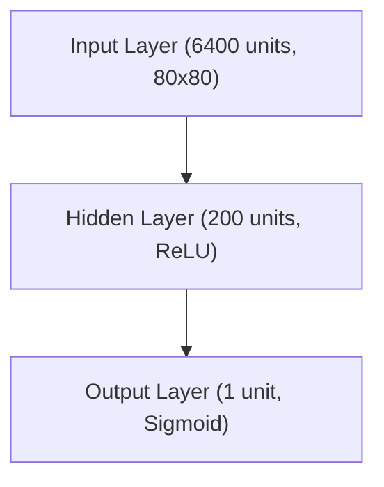

# RL: Policy Gradient Methods & Deep Q-Learning

## Project Overview
This project implements both Policy Gradient (REINFORCE) and Deep Q-Network (DQN) reinforcement learning algorithms to train agents to play Atari games including Pong, Breakout, and Ms. Pacman. The code is modular, easy to follow, and inspired by classic deep RL tutorials. The project uses modern Python, PyTorch, and cloud infrastructure.

## Features
- **Dual Algorithm Support**: Both Policy Gradient (REINFORCE) and Deep Q-Network (DQN) implementations
- **Multi-Game Support**: Train on Pong, Breakout, Ms. Pacman, and other Atari games with proper game-specific handling
- **Modern Gymnasium**: Upgraded from deprecated `gym` to modern `gymnasium` library
- **Python 3.13 Support**: Updated to work with the latest Python versions
- **PyTorch Optimization**: Enhanced MLP implementation with batch processing and GPU support
- **CNN Support**: Convolutional Neural Networks for spatial feature learning in games like Ms. Pacman
- **AWS GPU Hosting**: Complete cloud infrastructure with Terraform for GPU training
- **Advanced Model Management**: Sophisticated save/load system with episode tracking and versioning
- **Performance Tracking**: Real-time training metrics and episode statistics
- **Performance Optimizations**: GPU acceleration and batch processing improvements
- **Game-Specific Logic**: Proper handling of different game mechanics (e.g., FIRE action for Breakout)
- **Modular Architecture**: Clean separation of agent, memory, hyperparameters, and game environment
- **Frame Preprocessing**: Optimized image processing for neural network input
- **Type Annotations**: Full type safety for robust development

## Policy Gradients vs DQN: A Comparison

| Aspect | Policy Gradients (REINFORCE) | Deep Q-Network (DQN) |
|--------|------------------------------|----------------------|
| **Approach** | Policy-based (learns π(s) → a) | Value-based (learns Q(s,a)) |
| **Learning Type** | On-policy | Off-policy |
| **Action Spaces** | Continuous & Discrete | Discrete only |
| **Policy Type** | Stochastic | Deterministic |
| **Sample Efficiency** | Lower (requires more samples) | Higher (experience replay) |
| **Training Stability** | Less stable (high variance) | More stable (target networks) |
| **Implementation** | Simpler | More complex |
| **Best For** | Continuous actions, stochastic policies | Discrete actions, large state spaces |
| **Key Features** | Direct policy optimization | Experience replay, target networks |

## Directory Structure
```
Policy-Gradient/
├── src/                   # Source code modules
│   ├── pg/                # Policy Gradient implementation
│   │   ├── agent.py       # PG agent logic
│   │   ├── game.py        # Game environment
│   │   ├── hyperparameters.py # PG hyperparameters
│   │   ├── memory.py      # Episode memory buffer
│   │   ├── mlp.py         # Legacy MLP (NumPy)
│   │   └── mlp_torch.py   # Modern MLP (PyTorch)
│   └── dqn/               # DQN implementation
│       ├── agent.py       # DQN agent logic
│       ├── model.py       # Dueling CNN model
│       └── config/        # DQN configuration classes
│           ├── environment_config.py
│           ├── model_config.py
│           ├── training_config.py
│           ├── learning_config.py
│           ├── exploration_config.py
│           ├── image_config.py
│           └── hyperparameters.py
├── scripts/               # Executable scripts
│   ├── policy-gradient/   # PG training scripts
│   │   ├── pgpong.py      # Pong PG training
│   │   └── pgbreakout.py  # Breakout PG training
│   ├── dqn/               # DQN training scripts
│   │   ├── pong-dqn.py    # DQN Pong training
│   │   └── models/        # DQN model files
│   │       └── pong-cnn-* # DQN Pong models
│   ├── game_model_manager.py # Model management utilities
│   └── run_in_cloud.sh    # Cloud deployment script
├── models/                # Trained model files
│   ├── torch_mlp_ALE_Pong_v5_* # PG Pong models
│   ├── torch_mlp_ALE_Breakout_v5_* # PG Breakout models
├── terraform/             # Infrastructure as Code
│   ├── main.tf            # Main Terraform configuration
│   ├── variables.tf       # Variable definitions
│   ├── outputs.tf         # Output definitions
│   ├── setup.sh           # Instance setup script
│   └── check_status.sh    # Status monitoring script
├── assets/                # Images and diagrams
│   └── reinforce.png      # REINFORCE algorithm diagram
├── requirements.txt       # Python dependencies
└── README.md              # This file
```

## Quick Start
1. **Install Python 3.11+** (recommended: 3.13)
2. **Setup environment:**
   ```sh
   python3.13 -m venv venv
   source venv/bin/activate
   pip install -r requirements.txt
   ```

## Usage

### Policy Gradient Training (3 Scripts)

**1. Train on Pong (Binary Actions):**
```sh
python scripts/policy-gradient/pgpong.py
```
- Uses MLP with binary action space (UP/DOWN)
- Optimized for Pong's simple mechanics
- Fast training with 2-action policy

**2. Train on Breakout (Binary Actions):**
```sh
python scripts/policy-gradient/pgbreakout.py
```
- Uses MLP with binary action space (LEFT/RIGHT)
- Handles Breakout's paddle movement and ball physics
- Includes FIRE action for ball release

**3. Train on Ms. Pacman (Multi-Action CNN):**
```sh
python scripts/policy-gradient/pgpacman.py
```
- Uses CNN with 9-action space (all directions + NOOP)
- Color-aware preprocessing for ghost detection
- Advanced exploration with temperature scheduling
- Best for complex spatial reasoning

### Unified Policy Gradient Trainer

**Single script for all games:**
```sh
# Train Pong (loads latest model by default)
python scripts/policy-gradient/pg_trainer.py pong --render

# Train Breakout with custom parameters
python scripts/policy-gradient/pg_trainer.py breakout --learning-rate 2e-4 --batch-size 5

# Train Pacman from scratch (no pre-trained model)
python scripts/policy-gradient/pg_trainer.py pacman --no-load-network

# Train with specific episode number
python scripts/policy-gradient/pg_trainer.py pong --load-episode 50000
```

**Unified Trainer Options:**
- `game`: Choose from `pong`, `breakout`, `pacman`
- `--render`: Enable visual training
- `--no-load-network`: Don't load pre-trained network (defaults to loading)
- `--load-episode N`: Load from specific episode (defaults to latest for each game)
- `--learning-rate F`: Set learning rate
- `--batch-size N`: Set batch size
- `--save-interval N`: Set save interval
- `--network-file PATH`: Custom network file

**Default Behavior:**
- **Pong**: Loads from episode 70,000
- **Breakout**: Loads from episode 50,000  
- **Pacman**: Starts fresh (episode 0)
- **All games**: Automatically load latest available model unless `--no-load-network` is specified

**Modular Architecture:**
- `pg_trainer.py`: Main training logic (clean and focused)
- `game_configs.py`: Game-specific configurations and logic
- Easy to add new games by updating `game_configs.py`

**Benefits:**
- Single command for all games
- Consistent interface
- Easy parameter tuning
- Automatic game-specific handling
- Clean separation of concerns

### DQN Training (2 Scripts)

**4. Train on Pong (DQN):**
```sh
python scripts/dqn/pong-dqn.py
```
- Uses Dueling CNN architecture
- Experience replay and target networks
- Optimized hyperparameters for Pong

**5. Train on Ms. Pacman (DQN):**
```sh
python scripts/dqn/pacman-dqn.py
```
- Uses Dueling CNN with frame stacking
- Advanced exploration strategies
- Optimized for complex maze navigation

### Automated Training with Recording

**Run all scripts with recording:**
```sh
python scripts/run_all_with_recording.py
```
This script will:
- Train all 5 agents sequentially
- Record gameplay videos
- Save training metrics
- Generate performance reports

**Run individual script with recording:**
```sh
# Record Pong training
python scripts/run_with_recording.py scripts/policy-gradient/pgpong.py --max-episodes 500

# Record Pacman training with custom output
python scripts/run_with_recording.py scripts/policy-gradient/pgpacman.py --output-dir my_recordings
```

**Recording Script Options:**
- `--no-recording`: Disable video recording
- `--max-episodes N`: Limit episodes per script
- `--output-dir DIR`: Custom output directory

### Individual Script Options

Each script supports these common options:
- **Load pre-trained model**: Set `load_network = True` and `load_episode_number`
- **Enable rendering**: Set `render = True` for visual training
- **Custom hyperparameters**: Modify learning rates, batch sizes, etc.

### Model Management
Models are automatically saved with episode numbers:
- Policy Gradient: `torch_mlp_[game]_[episode]`
- DQN: `[game]-cnn-[episode].pkl`

**Load a specific model:**
```python
load_episode_number = 20000  # Load model from episode 20000
```

### Cloud GPU Training
1. **Deploy to AWS:**
   ```sh
   cd terraform
   terraform init
   terraform apply
   terraform destroy
   ```

2. **Monitor training:**
   ```sh
   ./check_status.sh
   ```

3. **Download results:**
   ```sh
   scp -i your-key.pem ubuntu@your-instance:~/Policy-Gradient/models/ ./models/
   ```

## Policy Gradient Implementation

### REINFORCE Algorithm


### Network Architecture
The PyTorch policy network features:
- **Input Layer**: 6400 units (80x80 preprocessed frames)
- **Hidden Layer**: 200 units with ReLU activation
- **Output Layer**: 1 unit with Sigmoid activation
- **GPU Acceleration**: Automatic CUDA support when available
- **Batch Processing**: Optimized for efficient training



### Ms. Pacman Action Space

In the Gym environment for Pac-Man (specifically Ms. Pacman on Atari 2600), there are 9 discrete actions available by default instead of just 4 because the action space is designed to allow for both the four primary cardinal movements—up, down, left, and right—and the four diagonals (up-right, up-left, down-right, down-left), as well as a NOOP (no operation) action.

Here's a table summarizing the 9 actions:

| Value | Meaning |
|-------|---------|
| 0 | NOOP |
| 1 | UP |
| 2 | RIGHT |
| 3 | LEFT |
| 4 | DOWN |
| 5 | UPRIGHT |
| 6 | UPLEFT |
| 7 | DOWNRIGHT |
| 8 | DOWNLEFT |

**Reason for this design:**
The Atari 2600 joystick allows for both cardinal and diagonal inputs, so the action space in Gym replicates this full set of available moves. This provides the agent with more granular control over movement, which can be crucial for navigating the maze and avoiding ghosts effectively.

### CNN Architecture for Ms. Pacman
For Ms. Pacman, we use a Convolutional Neural Network (CNN) to better process the spatial information:

- **Input**: 7 channels (6 color masks + grayscale) at 80×80 resolution
- **Conv1**: 32 filters, 8×8 kernel, stride 4 → Learns large spatial patterns
- **Conv2**: 64 filters, 4×4 kernel, stride 2 → Learns medium patterns
- **Conv3**: 64 filters, 3×3 kernel, stride 1 → Learns fine details
- **Fully Connected**: 200 hidden units → Final action probabilities
- **Output**: 9 action probabilities (one for each possible move)

This architecture allows the agent to understand spatial relationships between Pacman, ghosts, pellets, and the maze structure.

## DQN Implementation

### Network Architecture
The DQN uses a Dueling CNN architecture:
- **Input Layer**: Preprocessed game frames (80x64 grayscale)
- **Convolutional Layers**: Feature extraction from game pixels
- **Dueling Architecture**: Separate value and advantage streams
- **Output Layer**: Q-values for each action
- **Experience Replay**: Stores and samples past experiences
- **Target Network**: Stabilizes training with separate target network

### Key Features
- **Experience Replay Buffer**: Stores (state, action, reward, next_state, done) tuples
- **Target Network**: Separate network for computing target Q-values
- **Epsilon-Greedy Exploration**: Balances exploration vs exploitation
- **Frame Stacking**: Uses 4 consecutive frames as state representation

## Resources
- [Policy Gradients: Pong from Pixels](https://youtu.be/tqrcjHuNdmQ?si=XElMeYhPr7vCBb1b)
- [REINFORCE Algorithm](https://youtu.be/5eSh5F8gjWU?si=b1lRf6Ks_q_0dekA)
- [Karpathy's "Pong from Pixels"](http://karpathy.github.io/2016/05/31/rl/)
- [Gymnasium](https://gymnasium.farama.org/) | [PyTorch](https://pytorch.org/docs/)

## Contributing
This project is designed for educational purposes. Feel free to:
- Add more Atari games
- Implement additional RL algorithms
- Improve cloud infrastructure
- Add monitoring tools

## License
This project is open source and available under the MIT License.